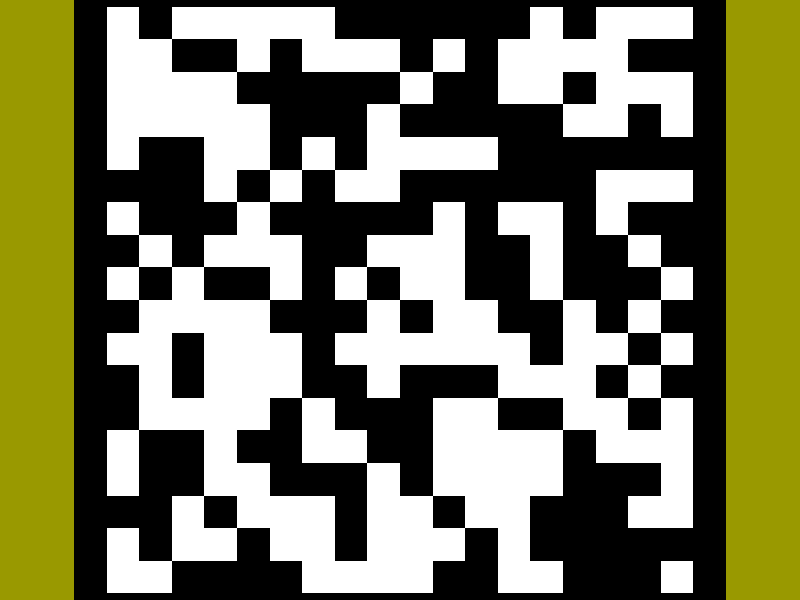

# Interactive Game of Life with OpenGL

## Game of Life
Game of Life by Mathematician J.H Conway is a simulation in which each cell in the grid-like world changes its binary state (alive or dead) 
according to the states of the neighboring cells following a simple rule.
The rule is:
1. If it is alive and less than 2 neighbors are alive, it dies.
2. If it is alive and two or three neighbors are alive, it stay alive.
3. If it is alive and more than three neighbors are alive, it dies by overpopulation.
4. If it is dead and exactly three neighbors are alive, it comes back alive

It is known that out of this very simple set of rules emerges extremely complex, unpredictable behaviors. It sparked the wave of investigation in various interesting initial configurations and other rule variants as a class of Cellular Automata.

## What this project is about
After finishing the first few chapters in [the amazing OpenGL tutorial by Joey de Vries](https://learnopengl.com/Introduction) I decided to make a simple application that is conceptually simple, achievable and fun. I've made in the past several Cellular Automata visualization using existing packages like [GNUPlot](http://www.gnuplot.info/) and [Matplotlib](https://matplotlib.org/stable/), but they were limited in real-time rendering capabilities and interactivity. So I decided it is a good idea to re-implement this beautiful _game_ with some added interactivity

## demo

## Implemented features
- Built purely with OpenGL and GLM. No game engine needed!
- **View mode** designed for enjoying the whole picture of time evolution and **Land mode** where you can walk about the ground and inspect the details.

## Planned features
- **Edit mode** where you can manipulate any cell's state as you like with a mouse click
- nicer visual
- function to save configurations you liked

## Planned-to-be-planned features
- It would be cool to integrate some _LLM-driven agent_ to perform automatic exploration of configuration space to test whether AI can learn to find/predict initial configurations that will produce _interesting_ time evolution.
